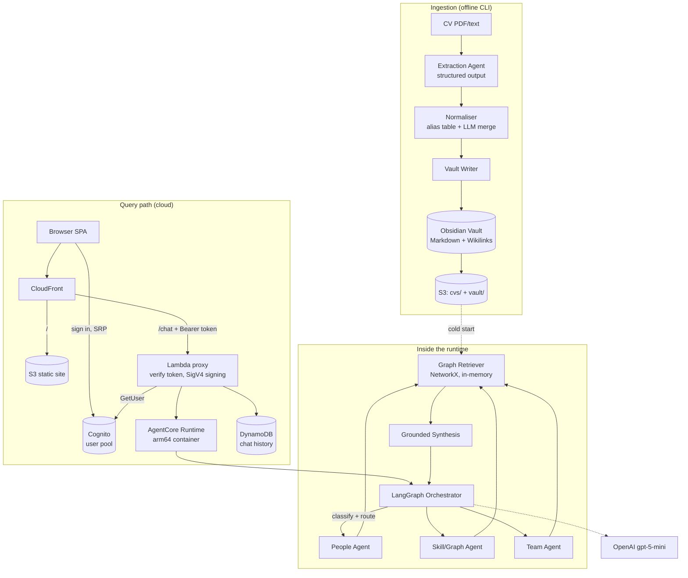

# TalentGraph

**A conversational knowledge graph for workforce intelligence.**

TalentGraph turns unstructured employee CVs into a human-readable knowledge graph
of Markdown notes linked by `[[Wikilinks]]`, then lets you interrogate that graph
in plain English through a LangGraph multi-agent system. Every answer is grounded
in the graph and ships with the relationships that justify it.

Live deployment: AWS Bedrock AgentCore Runtime behind CloudFront.
Guides: [Local Setup](LOCAL_SETUP.md) · [Deployment](DEPLOYMENT.md) · [Demo Script](DEMO.md)

---

## 1. Problem Statement

An organisation's capability data is trapped in CVs. Each document is written in a
different format, uses different words for the same skill ("Amazon Web Services"
vs "AWS", "ReactJS" vs "React"), and lives in isolation from every other document.

That makes routine workforce questions surprisingly expensive to answer:

- *Who knows both Python and AWS?* — someone opens every CV and takes notes.
- *Who could staff an AI project?* — judgement call, with no auditable evidence.
- *How is this person connected to NLP?* — invisible, because the relationships
  between people, skills, projects and technologies are never modelled anywhere.

The information exists. What is missing is **structure**, **normalisation**, and a
way to **ask questions in the language people actually use**.

## 2. Use Case

TalentGraph is an internal capability-discovery assistant for three roles:

| User | Question they bring | What TalentGraph returns |
| --- | --- | --- |
| **Workforce Manager** | "Which employees have AI experience?" | People with the relevant skills, plus the CV evidence for each |
| **Project Manager** | "Who suits a Python + AWS AI project?" | Ranked candidates with capability coverage and gaps |
| **Team Lead** | "Build a three-person team for Python, AWS and React" | A proposed team, what it covers, and what is missing |

It is explicitly an **advisory, informational prototype** — not an automated hiring
system. It makes no accept/reject decisions, ranks nobody on protected attributes,
and always shows the evidence behind a recommendation so a human can overrule it.

## 3. Solution Overview

The core idea: **make the knowledge graph the artefact, not a hidden index.**

```
CVs → structured extraction → normalised entities → Obsidian vault (the graph)
                                                          ↓
                    natural-language question → LangGraph agents → grounded answer
```

1. **Ingest** — CVs (PDF or text) are read and stored in S3.
2. **Extract** — an LLM pulls out people, skills, technologies, projects, domains,
   experience and education as validated structured data, each item carrying a
   verbatim quote from the CV as evidence.
3. **Normalise** — surface forms collapse to canonical entities, so "Amazon Web
   Services" and "AWS" become one node.
4. **Represent** — entities become Markdown notes and relationships become
   `[[Wikilinks]]`. The vault opens directly in [Obsidian](https://obsidian.md),
   where the graph is literally visible and clickable.
5. **Retrieve** — the vault is parsed into an in-memory typed graph that supports
   traversal, path-finding and capability coverage.
6. **Reason** — a LangGraph orchestrator classifies intent, routes to specialist
   agents, and synthesises an answer *from retrieved evidence only*.

Because the graph is plain Markdown, it is inspectable, diff-able, version-
controlled, and demonstrable without any database.

## 4. Dataset

Fictional CVs authored for this project. The `.txt` originals live in
`data/cv_sources/` and `scripts/generate_cv_pdfs.py` renders them into
`data/sample_cvs/`, which is the corpus the app actually indexes — one document
per person, so a CV removed through the library really is gone. The corpus is not
fixed: CVs can be added and removed at runtime through the app's CV library, which
rebuilds the graph around the change.

No real personal data is used: the CVs are synthetic, and the project integrates
with no external HR, ATS or social-network source.

The dataset is deliberately structured to make graph queries non-trivial:

- **Overlapping capabilities** — several people share Python; a subset also share
  AWS, so multi-constraint queries have meaningful answers.
- **A weak-match case** — one profile lists only "Basic Machine Learning", which
  lets the system distinguish a strong candidate from a plausible-but-weaker one
  and explain *why*.
- **Shared projects** — pairs of people collaborate on the same project, creating
  multi-hop paths (person → project → technology → person).
- **Normalisation traps** — "Amazon Web Services", "Natural Language Processing",
  "ReactJS" and "Application Programming Interface design" appear in their long
  forms specifically to test entity normalisation.

Expected answers for the benchmark questions are recorded in
[`tests/eval/ground_truth.md`](tests/eval/ground_truth.md) and drive the
evaluation harness.

## 5. AI/ML Approach

Five distinct AI components, each doing one job:

| Component | Technique | Why |
| --- | --- | --- |
| **CV extraction** | LLM with Pydantic-validated structured output | Schema enforcement makes the output a contract, not prose to parse |
| **Entity normalisation** | Deterministic alias table, then one LLM merge pass | The table is testable and free; the LLM only handles the long tail |
| **Intent classification** | LLM structured output → 7-intent enum + entities | Routes each question to the right specialist agent |
| **Graph retrieval** | Deterministic traversal (NetworkX) | Precise and explainable — no embedding fuzziness for a factual question |
| **Answer synthesis** | LLM constrained to supplied evidence | Grounded, cited, and refuses when the graph has no answer |

**Retrieval is graph-based, not vector-based.** For questions like *"who has both
Python and AWS?"*, a set intersection over typed edges is exactly correct, whereas
embedding similarity is merely close. The graph also yields the *path* between two
entities, which is what makes an answer explainable. At this corpus size a vector
store would add cost and infrastructure without improving precision.

**Model:** OpenAI `gpt-5-mini`, chosen for cost-efficiency. Access is isolated
behind `app/llm/provider.py`, so swapping models or providers touches one file.
Structured-output responses are cached on disk, making re-ingestion free during
development. A typical question costs ~2 LLM calls: one to classify, one to answer.

### The relationship model

```
Person ──HAS_SKILL──────► Skill          Project ──USES─────────► Technology
Person ──USES───────────► Technology     Project ──IN_DOMAIN────► Domain
Person ──WORKED_ON──────► Project        Skill   ──RELATED_TO───► Skill
Person ──EXPERIENCE_IN──► Domain
Person ──STUDIED────────► Education
```

`RELATED_TO` is derived deterministically from co-occurrence: two skills are
related when enough people hold both.

### Agents

- **Orchestrator** — classifies intent, resolves follow-up references against
  history, routes, and synthesises the final grounded answer.
- **People Agent** — person-centric lookup and capability matching.
- **Skill/Graph Agent** — relationships and paths between entities.
- **Team Analysis Agent** — candidate ranking, greedy team composition, gap analysis.

## 6. Application Architecture



**Ingestion is offline and runs once per dataset**, so the cloud runtime stays
read-only and fast. The runtime pulls the vault from S3 at cold start and holds
the parsed graph in memory for the life of the container.

**One `handle_chat()` core, two adapters:** FastAPI locally
(`app/api/server.py`), the AgentCore entrypoint in the cloud (`app/main.py`).
Identical behaviour in both places.

**Why a Lambda proxy?** Invoking AgentCore requires SigV4-signed requests, which a
browser cannot produce. CloudFront serves the SPA and the API from one origin, so
the frontend makes same-origin calls and needs no CORS or hardcoded endpoint.

**Why the gate sits in the proxy.** The site is on a public CloudFront URL, so the
API needs a lock. The proxy is the only way in to the data — the runtime is
reachable only through SigV4 calls the proxy itself makes — which makes it the one
place a check has to go. It validates each request's Cognito access token by
calling `GetUser` with it, so there is no JWT library, no JWKS cache, and no
bundling step for what is otherwise a dependency-free Lambda. Sign-up is disabled:
the single operator account is created with `make cognito-user`, so possession of
credentials, not knowledge of the URL, is what grants access. The static bundle
stays public — it holds no data, and every request it makes is gated.

### Routes

The SPA is a routed application, not a single screen with conditional rendering.
Guards live in `components/RouteGuards.tsx` and read the session shared by
`session.tsx`:

| Path | Screen | Guard |
| --- | --- | --- |
| `/` | Landing | Redirects to `/app` when already signed in |
| `/login` | Sign-in form | Redirects to `/app` if signed in, or if no pool is configured |
| `/app` | Chat | **Requires a session** — otherwise redirects to `/login`, remembering the target so sign-in resumes it |
| anything else | — | Redirects to `/` |

`/app` rather than `/chat` is deliberate: CloudFront routes `/chat`,
`/conversations*`, `/cvs*` and `/graph` to the Lambda proxy, so a page at `/chat` would
reach the API instead of the SPA. Deep links survive a refresh because the
distribution already rewrites S3's 403 for an unknown key to `/index.html`.

### Repository layout

```
backend/         ingestion pipeline, CV store, graph layer, LangGraph agents, API adapters
frontend/        React + Vite SPA — routed: landing, login, chat
infrastructure/  AWS CDK app (stack + Lambda proxy)
data/cv_sources/  authored CV originals (.txt), rendered into the corpus below
data/sample_cvs/ the indexed CV corpus — one document per person
vault/           the generated knowledge graph (committed, openable in Obsidian)
tests/           unit tests + evaluation set
scripts/         PDF generation, evaluation harness
```

## 7. Technology Stack

| Layer | Choice |
| --- | --- |
| **AI/LLM** | OpenAI `gpt-5-mini`, structured outputs (Pydantic schemas) |
| **Orchestration** | LangGraph — stateful multi-agent `StateGraph` |
| **Graph** | NetworkX `MultiDiGraph`; Obsidian-style Markdown as the source of truth |
| **Extraction** | pypdf, python-frontmatter |
| **Backend** | Python 3.12, FastAPI + Uvicorn (local), `bedrock-agentcore` SDK (cloud) |
| **Frontend** | React 19, TypeScript, Vite, React Router, react-markdown |
| **Compute** | AWS Bedrock AgentCore Runtime (arm64 container) |
| **Storage** | Amazon S3 (CVs + vault), DynamoDB (chat history) |
| **Delivery** | CloudFront + S3 static hosting, Lambda Function URL proxy |
| **Auth** | Amazon Cognito user pool, SRP from the browser (`amazon-cognito-identity-js`) |
| **Secrets** | SSM Parameter Store (SecureString) |
| **IaC** | AWS CDK (Python) |
| **Tooling** | uv, ruff, pytest, Docker |

**Deliberately not used:** OpenSearch, RDS, ECS/EKS, API Gateway, or a dedicated
graph database. At this scale the Markdown vault plus in-memory traversal is
faster to reason about and costs nothing to run. Each has a documented trigger for
reconsideration — see [Deployment](DEPLOYMENT.md).

## 8. Local Setup Instructions

Full walkthrough: **[LOCAL_SETUP.md](LOCAL_SETUP.md)**. No AWS account needed.

```bash
make install                          # uv sync backend + infrastructure, npm install frontend
cp backend/.env.example backend/.env  # then set OPENAI_API_KEY
make serve                            # FastAPI backend  → http://localhost:8000
make frontend-dev                     # chat UI          → http://localhost:5173
```

The generated vault is committed, so **no ingestion is needed before the first
run**. Prefer the terminal? `make chat`. Rebuild the graph from CVs with
`make ingest`; run `make test` and `make lint` for checks.

Once the stack has been deployed, `make serve` and `make frontend-dev` pick the
Cognito pool up from its outputs automatically, so local runs exercise the same
real login as production rather than an ungated shortcut.

## 9. Deployment Details

Full walkthrough: **[DEPLOYMENT.md](DEPLOYMENT.md)**.

One CDK stack in `us-east-1` creates every resource: S3 data bucket, S3 site
bucket, DynamoDB table, Cognito user pool, AgentCore Runtime (arm64 image built
from `backend/`), Lambda proxy with a Function URL, and a CloudFront distribution
routing `/` to the SPA and `/chat`, `/conversations*`, `/cvs*` + `/graph` to the proxy.

```bash
make openai-key    # once: OpenAI key → SSM SecureString
make bootstrap     # once per account/region
make deploy        # build SPA + arm64 image, create/update all resources
make cognito-user  # once: create the operator account in the new pool
make deploy        # again — the SPA needs the pool ids, which now exist
make upload        # push CVs + vault to the data bucket
make outputs       # print SiteUrl, ApiFunctionUrl, AgentRuntimeArn, pool ids
```

The double `make deploy` is not a typo: the SPA is built with the pool ids baked
in, and the pool does not exist until the first deploy creates it. Later deploys
are single-pass, since the ids are then stable.

Resource names live in `backend/.env` and are read by both the backend and CDK, so
each is defined exactly once.

Redeploying never recreates your data: CloudFormation updates in place, and the
data bucket, conversations table and user pool are all `RETAIN`, so neither a
`make destroy` nor a replacement-forcing change can delete them. `RETAIN_DATA=false`
in `backend/.env` opts a throwaway environment out — see [Deployment](DEPLOYMENT.md).

**Cost profile:** nothing is always-on. AgentCore bills per invocation, Lambda and
DynamoDB are effectively free at this volume, S3 and CloudFront cost cents, and
LLM spend is ~2 `gpt-5-mini` calls per question.

## 10. API / Web Application Usage

### Web

Open the `SiteUrl` from `make outputs` (or `http://localhost:5173` locally). You
arrive on the landing page at `/`; **Sign in** goes to `/login`, and the account is
the one created by `make cognito-user`. After signing in you land on `/app`.
**Sign out** sits at the foot of the sidebar and returns you to `/`. Navigating
straight to `/app` while signed out bounces you to `/login` and then back to
`/app` once you authenticate.

Before a first deploy there is no user pool, so the landing button reads *Open the
app* and goes straight to the workspace.

**The workspace.** Signing in lands on the graph, with the chat docked beside it as
a split screen. Either side collapses to a rail and expands again from it — from the
rail itself, from the chevron in a panel header, or from the *Graph* / *Chat*
switches in the sidebar — and the divider between them drags (or takes arrow keys)
to rebalance the split; a double-click restores it. Collapsing one panel always
leaves the other open, and the layout is remembered across sessions.

Type a question, or pick one from the examples. Each answer shows the detected
intent and an expandable **Evidence** panel listing the graph relationships behind
it. Follow-up questions work — *"Who has Python and AWS?"* then *"Which of them
has AI experience?"* resolves correctly against conversation history.

**Graph explorer.** The graph panel draws the vault itself — every
note as a node, every `[[Wikilink]]` as a typed edge, laid out by a force
simulation. Nodes are sized by how well connected they are and coloured by note
type, and the legend doubles as a filter, so hiding *Technologies* leaves the
people-to-skills structure on its own. Hovering lights up a note's immediate
neighbourhood; clicking one opens its connections in the detail rail, each with
its relation and the CV sentence the relation came from. **Focus** narrows the
canvas to just the selected note and what it touches, which is the readable way
to look at one person. Entity names inside an answer's **Evidence** panel are
links into this view, so a claim in an answer selects that note in the graph
beside it — expanding the graph panel first if it was collapsed.

**CV library.** The sidebar opens the corpus the graph is built from: drop in a
PDF, TXT or Markdown CV and it is extracted and folded into the graph, or remove
one and its entities go with it. Both are accepted immediately and indexed in the
background — the panel polls until the new index is published, because a rebuild
re-reads the whole corpus and takes a minute or two.

### API

```bash
curl -X POST http://localhost:8000/chat \
  -H 'Content-Type: application/json' \
  -d '{"message": "Who has both Python and AWS?", "conversation_id": "demo-001"}'
```

```jsonc
{
  "answer": "Four people have both Python and AWS: ...",
  "intent": "PEOPLE_LOOKUP",
  "evidence": [
    { "kind": "relation", "detail": "Alice Perera —HAS_SKILL→ Python",
      "source": "vault/People/Alice Perera.md" }
  ],
  "conversation_id": "demo-001"
}
```

| Method | Endpoint | Purpose |
| --- | --- | --- |
| `POST` | `/chat` | Ask a question (`message`, optional `conversation_id`) |
| `GET` | `/conversations` | List conversation threads |
| `GET` | `/conversations/{id}` | Full thread with turns and evidence |
| `DELETE` | `/conversations/{id}` | Delete a thread |
| `GET` | `/graph` | The whole knowledge graph as nodes and edges, for the graph explorer |
| `GET` | `/cvs` | List the CV corpus, each with the person indexed from it |
| `POST` | `/cvs` | Upload a CV (`filename`, `content_base64`) — `202`, indexes in the background |
| `DELETE` | `/cvs/{filename}` | Remove a CV — `202`, reindexes in the background |
| `GET` | `/health` | Health check (the only unauthenticated route) |

Every route except `/health` requires `Authorization: Bearer <Cognito access
token>` once a user pool is configured, and answers `401` without one. Locally
there is no pool, so the gate is off and the `curl` examples work as written; add
the header when calling a deployed instance.

Uploading a CV takes the same shape everywhere:

```bash
curl -X POST http://localhost:8000/cvs \
  -H 'Content-Type: application/json' \
  -d "{\"filename\": \"jane_doe.pdf\", \"content_base64\": \"$(base64 < jane_doe.pdf)\"}"
# 202 Accepted — poll GET /cvs until `indexed_at` changes
```

Interactive Swagger UI runs at `http://localhost:8000/docs`. In the cloud the same
routes are served through CloudFront (the AgentCore runtime multiplexes them via an
`action` field, handled by the Lambda proxy).

Questions the system handles: people lookup, skill discovery, relationship
exploration, project matching, team composition, and skill-gap analysis.

## 11. Docker Instructions

The backend image is what actually runs in production — AgentCore Runtime executes
it as a `linux/arm64` container serving `/invocations` and `/ping` on port 8080.
`make deploy` builds and pushes it automatically; to run it by hand:

```bash
cd backend
docker build --platform linux/arm64 -t talentgraph .

docker run --rm -p 8080:8080 \
  --env-file .env \
  -e VAULT_DIR=/vault -v "$(pwd)/../vault:/vault" \
  talentgraph
```

```bash
curl -X POST localhost:8080/invocations \
  -H 'Content-Type: application/json' \
  -d '{"message": "Who knows React?", "conversation_id": "docker-demo"}'

curl localhost:8080/ping     # health check
```

The vault is mounted rather than baked into the image: in the cloud the container
downloads it from S3 at cold start (`VAULT_SOURCE=s3`), which keeps the image
independent of the dataset.

---

## Responsible use

TalentGraph is an academic prototype built on fictional data. It is advisory only:
it makes no hiring decisions, never ranks people on protected attributes, and
attaches evidence to every recommendation so a human stays accountable for the
call. Answers are constrained to the knowledge graph — when the graph does not
support an answer, the system says so rather than speculating.
